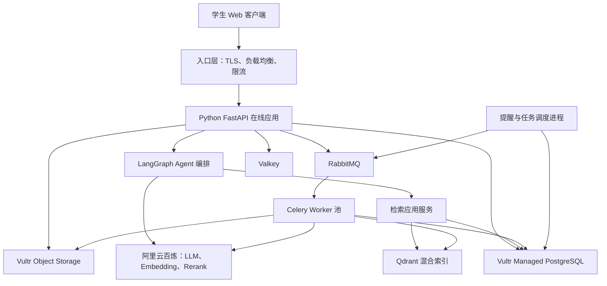
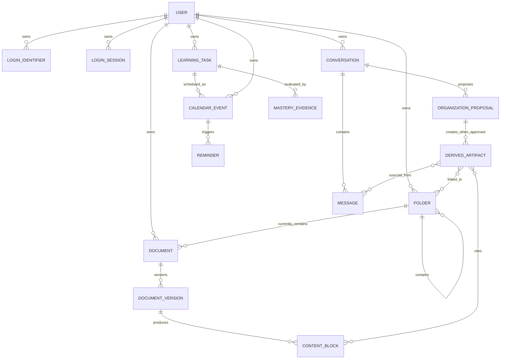
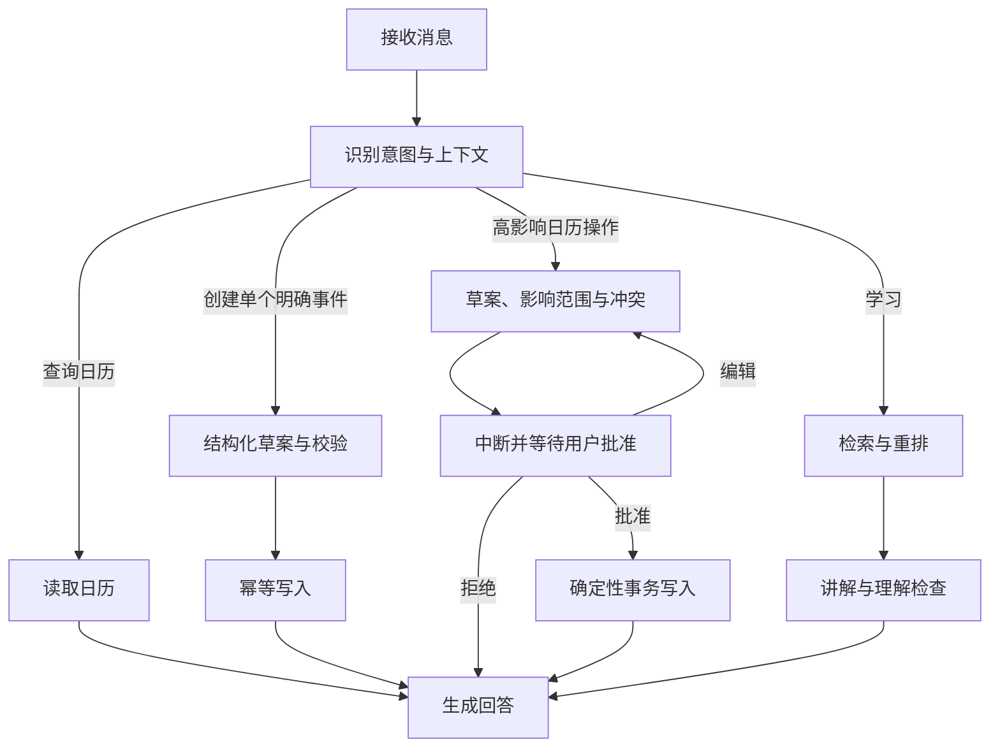

# Time 首版系统设计

状态：已批准

版本：1.0

日期：2026-07-17

## 1. 设计目标

系统面向约 1000 名大学生和 TB 级原始资料，采用生产可落地的模块化单体。代码保持单仓库和清晰领域边界，运行时拆分在线 API、Agent 编排、异步 Worker、定时调度和检索服务。

设计优先级：

1. 用户数据隔离；
2. 业务状态可追溯和可恢复；
3. 日历写操作确定性；
4. RAG 来源可靠；
5. 耗时任务与在线请求隔离；
6. 可测试、可观测、可渐进扩展；
7. 不因追求“云原生”提前引入分布式复杂度。

## 2. 系统上下文



Vultr 资源部署在日本地域。大模型、Embedding 和重排调用中国大陆供应商，系统记录该跨地域处理链路。

## 3. 技术基线

### Web

- React；
- TypeScript；
- React Router；
- Vite；
- TanStack Query；
- 由 OpenAPI 生成的 TypeScript API 客户端；
- SSE 流式接收 Agent 输出和处理进度；
- Playwright 端到端测试。

首版不增加 Next.js 服务端。产品是登录后的交互应用，Python API 是唯一业务入口，避免同时维护 Node.js 与 Python 两套认证和服务端状态。

### Python 在线应用

- FastAPI 提供 HTTP、OpenAPI 和 SSE；
- Pydantic 校验请求、响应和 Tool Schema；
- SQLAlchemy 管理数据访问；
- Alembic 管理数据库迁移；
- LangGraph 编排在线 Agent；
- LangChain 仅提供模型、消息、工具等基础组件；
- 领域规则独立于路由、ORM、LangChain 和 LangGraph 类型。

### 异步与数据

- Celery 执行资料解析、索引、整理和通知任务；
- RabbitMQ 作为任务 Broker，只传小型标识和任务参数，不传文件正文；
- PostgreSQL 保存业务事实、任务状态和审计；
- Object Storage 保存原始文件和可重新生成的派生文件；
- Qdrant 保存可重建的混合检索索引；
- Valkey 保存限流、短期缓存和分布式协调数据，不保存唯一业务事实。

### 部署

- Docker 不可变镜像；
- Terraform 管理 Vultr 资源；
- Cloud Compute 运行在线应用、Worker、RabbitMQ 和 Qdrant；
- Managed PostgreSQL 保存业务数据；
- Object Storage 保存文件；
- 首版不使用 Kubernetes；
- 具体实例规格、连接池和 Worker 数量通过负载测试确定。

## 4. 领域模块

模块名称是设计概念，实施计划负责定义最终包路径。任何模块只能通过公开应用接口访问其他模块，禁止跨模块直接操作内部 ORM 对象。

### 4.1 账号与认证

职责：

- 邮箱和手机号标识；
- 验证码挑战；
- 密码凭证；
- 登录会话；
- 会话撤销；
- 登录审计；
- 认证限流。

不负责：业务权限过滤、资料或日历状态。

### 4.2 日历

职责：

- 事件和重复规则；
- 例外实例；
- 冲突和空闲时间；
- 提醒计划；
- 幂等写入；
- 并发版本检查；
- 变更审计和补偿操作。

日历模块不信任模型输出。所有 Agent 草案必须转换为模块公开命令并重新校验。

### 4.3 学习

职责：

- 学习任务；
- 资料关联；
- 预计用时和进度；
- 掌握证据；
- 排期提案；
- 学习会话结果。

学习任务与日历事件通过明确关联连接，不共享同一实体。

### 4.4 对话与 Agent

职责：

- 原始会话和消息；
- LangGraph 执行实例关联；
- 流式回答；
- Tool 调用记录；
- 会话整理提案；
- 回答来源追踪。

LangGraph Checkpoint 是执行状态，不是原始对话或长期学习记忆的权威存储。

### 4.5 知识空间

职责：

- 逻辑文件夹树；
- 资料记录及版本；
- 文件移动历史；
- 收件箱；
- 文件整理提案；
- 批准后的派生学习条目；
- 来源引用。

### 4.6 资料处理

职责：

- 上传会话；
- 对象完整性校验；
- 文件类型验证；
- PDF／DOCX 纯文本解析；
- 内容块生成；
- 处理状态与重试；
- Embedding 和索引版本发布；
- 删除清理任务。

首版不包含 OCR 或图片处理。

### 4.7 检索

职责：

- 查询改写；
- 范围和租户过滤；
- 稀疏与稠密召回；
- RRF 融合；
- 重排；
- 上下文去重和预算；
- 检索日志；
- 内容块反查。

### 4.8 通知

职责：

- 站内通知；
- 浏览器通知；
- 提醒投递；
- 投递状态；
- 重试和失败记录。

## 5. 核心数据关系



实现数据表时所有用户数据携带明确的用户归属。关系数据库标识、对象存储键和索引标识使用系统生成的不透明值，不能依赖用户文件名作为身份。

## 6. Agent 编排边界

### 6.1 为什么采用 LangGraph

LangGraph 用于：

- 在线会话状态图；
- 流式输出；
- 长步骤恢复；
- 高影响操作前暂停；
- 用户批准、编辑或拒绝后继续；
- 执行路径追踪。

### 6.2 LangChain 使用限制

允许：

- 模型适配；
- 消息表示；
- Tool Schema；
- Agent 中间件；
- LangGraph 所需的基础集成。

禁止：

- LangChain Memory 作为长期记忆唯一来源；
- VectorStore 绕过检索权限层；
- 框架 Document 类型成为正式业务实体；
- Agent 直接访问数据库；
- LangGraph Checkpoint 代替日历事务、对话历史或资料处理状态；
- 领域模块暴露 LangChain／LangGraph 类型。

### 6.3 Agent 状态图



LangGraph 节点在恢复时可能重跑，因此中断前不得执行非幂等副作用。写操作必须位于批准后的独立节点，并携带业务幂等标识。

## 7. 文件上传和处理

### 7.1 上传

1. API 验证认证、账号权益、文件扩展名、声明大小和上传频率；
2. API 创建上传会话和资料版本草案；
3. 浏览器使用短期预签名 URL 分片直传对象存储；
4. 浏览器通知 API 上传完成；
5. API 从对象存储读取对象元数据并验证大小、校验值和归属；
6. API 提交事务：标记上传确认，并通过 Outbox 产生处理任务；
7. Dispatcher 将任务发送到 RabbitMQ；
8. Worker 开始解析。

Vultr Object Storage 当前不支持 Bucket Notification，因此系统不依赖对象存储自动触发处理。

### 7.2 处理状态

资料版本采用明确状态机：

```text
上传中
→ 已上传待处理
→ 解析中
→ 待整理审批
→ 索引构建中
→ 可检索

任一处理阶段
→ 可重试失败
→ 重试中

任一处理阶段
→ 永久失败
```

不存在“部分异常但显示成功”的隐式状态。部分页面或段落解析失败时，版本标记为部分可用并展示缺失范围。

### 7.3 纯文本解析

- PDF：提取文本层、页码和可确定的位置；
- DOCX：提取标题层级、段落和表格文本；
- 每个内容块保存资料版本、序号、页码或结构路径、文本、内容类型和解析器版本；
- 无可用文本时返回“不支持的扫描资料”；
- 图片和嵌入图像不进入索引；
- 重解析创建新的派生版本，不覆盖上一解析结果。

### 7.4 整理和发布

解析完成后生成文件整理提案。用户批准后更新逻辑目录关系，再构建索引。新索引完整构建并通过计数、抽样和版本校验后原子发布；失败时继续使用上一可用索引版本。

## 8. RAG 设计

### 8.1 索引模型

PostgreSQL 保存完整内容块和业务元数据。Qdrant 保存：

- 内容块不透明标识；
- 资料和资料版本标识；
- 用户和文件夹范围；
- 稠密向量；
- 稀疏词项表示；
- 索引版本；
- 最小化的检索展示元数据。

一个 Embedding 模型和维度对应一套集合。用户通过 Payload 分区和过滤实现多租户，不能为每个学生建立独立集合。Qdrant 仅由后端私网访问，客户端不能直连。

### 8.2 检索流水线

```text
问题和当前资料范围
→ 强制用户与权限过滤
→ 查询改写
→ 稠密向量召回
+ 稀疏关键词召回
→ RRF 融合
→ qwen3-rerank 重排
→ 来源去重
→ 上下文预算和证据强度检查
→ Agent 讲解
→ 行内引用和回答追踪
```

中文稀疏检索必须用真实资料评测。Qdrant 不能达到既定 Recall@10 和引用门槛时，在上线前通过新 ADR 将检索实现替换为 OpenSearch；业务模块只依赖内部检索接口。

### 8.3 来源可信度

检索结果区分：

- 原始资料；
- 用户批准的派生笔记；
- 其他资料；
- 模型通用补充。

未批准提案不进入默认索引。资料内容被视为不可信输入，文档中包含的“指令”不能修改系统提示词、调用工具或绕过权限。

## 9. 日历一致性

### 9.1 写入

- API 和 Agent 共用同一应用命令；
- 命令包含幂等标识、期望版本、操作者和来源；
- 应用服务在事务内完成权限、版本、时间和重复规则校验；
- 业务记录与 Outbox 记录在同一事务提交；
- 通知和审计下游异步消费 Outbox；
- 重复请求返回首次执行结果。

### 9.2 批量排期

批量学习计划先生成提案，不直接写入。用户批准后，所有新增事件在一个业务事务内提交；任何验证失败都不留下半套计划。

### 9.3 重复事件

重复系列保存规则和时区，单次变更保存例外。查询在限定时间范围内展开实例。修改“本次及后续”通过截断原系列并创建新系列实现，两个系列保留来源关系。

## 10. 多租户和安全边界

- 用户身份由认证中间件解析，不接受客户端声明的用户标识作为权威；
- 所有仓储查询强制注入当前用户范围；
- 检索服务强制附加用户 Payload 过滤；
- 对象存储使用私有 Bucket 和短期预签名 URL；
- 对象键不包含邮箱、手机号或原始文件名；
- 上传后校验真实对象元数据，不能只信任浏览器回调；
- 文件下载重新进行权限检查；
- 外部模型只接收完成当前任务所需的最少片段；
- 日志、Trace 和模型观测不得记录完整资料、密码、验证码、Cookie 或供应商密钥；
- 所有外部调用具有超时、限流、重试预算和熔断；
- 高影响工具执行前要求用户批准；
- 跨用户检索、下载或引用是零容忍发布阻断问题。

## 11. 删除与数据生命周期

### 11.1 资料删除

删除资料先写入删除意图并停止新检索，再异步清理：

1. 当前索引版本；
2. 内容块；
3. 派生解析文件；
4. 原始对象；
5. 与派生条目的引用关系。

清理任务逐项记录结果。失败进入人工处理队列，不能在仍有残留时显示“已彻底删除”。审计记录保留最小化事件，不保留被删除资料正文。

### 11.2 账号删除

账号删除触发可审计的级联清理工作流，先撤销登录会话和禁止新操作，再清理业务数据、对象和索引。法定或运营保留规则不在首版自行假设，部署前通过正式隐私政策确定。

## 12. 错误处理与恢复

- 所有外部调用设置明确超时；
- 可重试错误采用有上限的指数退避和抖动；
- 永久错误不自动无限重试；
- Worker 任务使用业务幂等键；
- 任务状态和错误保存在 PostgreSQL；
- RabbitMQ 消息不是任务完成的权威记录；
- 达到重试上限后进入失败队列并向用户展示可理解原因；
- 新索引失败时保留上一版本；
- 模型供应商失败时日历和资料管理保持可用；
- 未完成的 LangGraph 执行从持久化 Checkpoint 恢复，但写操作再次经过幂等检查。

## 13. 可观测性

统一关联以下标识：

- 请求；
- 用户会话；
- 对话；
- LangGraph 执行；
- Tool 调用；
- 上传会话；
- 资料版本；
- 异步任务；
- 检索调用；
- 日历变更。

使用 OpenTelemetry 采集 Trace，Prometheus 采集指标，集中式日志保存结构化事件。业务审计与技术日志分离，审计记录不能依赖普通日志保留策略。

## 14. 扩展边界

以下能力通过接口预留，不在首版实现：

- OCR 和图片资料；
- 外部日历和课表导入；
- 多供应商模型自动故障切换；
- 微服务和 VKE；
- 多模态 Embedding；
- 原生移动端。

“预留”只代表数据身份和接口边界不阻塞未来演进，不允许提交未使用的实现代码。

## 15. 参考依据

- [FastAPI OpenAPI 特性](https://fastapi.tiangolo.com/features/)
- [React 创建应用指南](https://react.dev/learn/creating-a-react-app)
- [Celery Broker 文档](https://docs.celeryq.dev/en/stable/getting-started/backends-and-brokers/index.html)
- [LangGraph 概览](https://docs.langchain.com/oss/python/langgraph/overview)
- [LangGraph Persistence](https://docs.langchain.com/oss/python/langgraph/persistence)
- [LangGraph Interrupts](https://docs.langchain.com/oss/python/langgraph/interrupts)
- [Qdrant 混合检索](https://qdrant.tech/documentation/search/text-search/hybrid-search/)
- [Qdrant 多租户](https://qdrant.tech/documentation/tutorials/multiple-partitions/)
- [阿里云百炼向量与重排序](https://help.aliyun.com/zh/model-studio/embedding-rerank-model)
- [Vultr Object Storage 兼容矩阵](https://docs.vultr.com/products/storage/object-storage/s3-compatibility-matrix)
